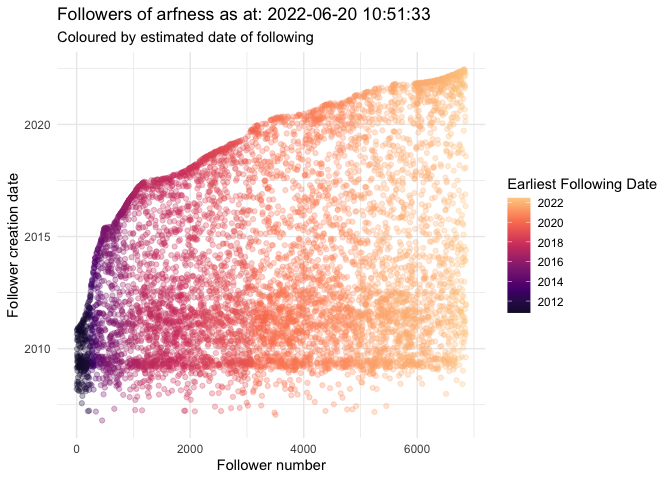

rtweetXtras
===========

A collection of helper functions for twitter analysis using the {rtweet}
package. NB: these functions have MANY dependencies… no warranty is
offered, but please feel free to log issues.

To install the package, use the {remotes} or {devtools} package:
`remotes::install_github("arf9999/rtweetXtras")`

### hashtagcloud

`hashtagcloud(rtweet_timeline_df, num_words = 200)`

Delivers a wordcloud of hashtag terms in an rtweet tibble.

    df <- rtweet::get_timeline("jack", n=1000)
    rtweetXtras::hashtagcloud(df, n=200)

### profilecloud

`profilecloud(rtweet_timeline_df, num_words = 200)`  
Delivers a wordcloud of terms in unique twitter user profiles in an
rtweet tibble.

    df1 <- rtweet::search_tweets("rstats",lang = "en", n= 2000)
    rtweetXtras::profilecloud(df1, 100)

### bar\_plot\_mentions

`bar_plot_mentions(rtweet_df, no_of_bars = 20, title = NULL)`  
Delivers a bar plot of the count of user mentions in an rtweet tibble.
Defaults to top twenty mentioned accounts.

    df1 <- rtweet::search_tweets("#rstats", lang = "en", n = 2000)
    rtweetXtras::bar_plot_mentions(df1, 20, title = paste("Barplot of user mentions in twitter search for \"#rstats\"", Sys.Date()))

### common\_follower\_analysis

`common_follower_analysis (user_list, follower_depth = 200, no_of_sets = 7, token = NULL)`  
This function creates an UpSetR graph of common followers Code cribbed
from Bob Rudis’ 21 Recipes for Mining Twitter with Rtweet
<a href="https://rud.is/books/21-recipes/visualizing-intersecting-follower-sets-with-upsetr.html" class="uri">https://rud.is/books/21-recipes/visualizing-intersecting-follower-sets-with-upsetr.html</a>

     rstats_list <- c("hadleywickham", "dataandme", "juliasilge", "statgarrett","thomasp85")
     
    rtweetXtras::common_follower_analysis(rstats_list, follower_depth = 1000, no_of_sets = 5, token = NULL)

### common\_follower\_matrix

`common_follower_matrix (user_list, follower_depth = 200, token = NULL)`  
This function creates a matrix of followers of a list of twitter users,
sums the number of common followers, and then ranks them in descending
order.

      rstats_list <- c("hadleywickham", "dataandme", "juliasilge", "statgarrett","thomasp85")

     fm <- rtweetXtras::common_follower_matrix(rstats_list, follower_depth = 200, token = NULL)
     dplyr::glimpse(fm)

    ## Rows: 869
    ## Columns: 9
    ## $ screen_name       <chr> "Dunson30612519", "AnalyticsMn", "pisanoontweet", "…
    ## $ user_id           <chr> "1239237087548891136", "1317986654280388609", "1918…
    ## $ hadleywickham     <dbl> 1, 1, 1, 1, 0, 0, 0, 1, 1, 1, 0, 0, 0, 0, 0, 0, 0, …
    ## $ dataandme         <dbl> 1, 1, 0, 1, 1, 1, 1, 1, 1, 1, 1, 1, 1, 1, 1, 1, 1, …
    ## $ juliasilge        <dbl> 1, 1, 1, 1, 1, 1, 1, 1, 1, 1, 1, 1, 0, 0, 1, 1, 1, …
    ## $ statgarrett       <dbl> 1, 1, 1, 1, 1, 1, 1, 0, 0, 0, 1, 1, 1, 1, 1, 0, 1, …
    ## $ thomasp85         <dbl> 1, 1, 1, 0, 1, 1, 1, 0, 0, 0, 0, 0, 1, 1, 0, 1, 0, …
    ## $ sum_intersections <dbl> 5, 5, 4, 4, 4, 4, 4, 3, 3, 3, 3, 3, 3, 3, 3, 3, 3, …
    ## $ ranking           <int> 1, 1, 2, 2, 2, 2, 2, 3, 3, 3, 3, 3, 3, 3, 3, 3, 3, …

### account\_activity

`account_activity(account_name, depth = 3200, time_zone = "Africa/Johannesburg", no_of_weeks = 4,  token = NULL)`  
This function creates a bubble plot of account activity by hour of a
single twitter screen\_name  
(inspired by python script by twitter user “\[@Conspirator0\]”)

     rtweetXtras::account_activity("arfness", depth = 1000, time_zone = "Africa/Johannesburg", no_of_weeks = 5, token = NULL)

### follower\_dot\_plot

`follower_dot_plot(follower_df, point_colour = "statuses_count", show_legend = TRUE, suppress_warnings = TRUE, include_loess_smooth = FALSE, include_lm = FALSE, print_immediately = TRUE, log_transform = FALSE, viridis_option = "magma")`

This builds a ggplot2 scatter plot with the creation date of twitter
followers mapped to the order in which they followed. Various options of
dot colouring are available to examine the follower’s attributes.
Optionally, a loess smoothed curve and/or a linear model can be overlaid
to analyse the change in follower creation dates over time.

    arfness_followers <- rtweetXtras::get_followers_fast("arfness")

    ## [1] "arfness follower count = 4881"
    ## [1] "followers captured: 4880 out of 4881"

    rtweetXtras::follower_dot_plot(arfness_followers, point_colour = "earliest_follow")

### Other functions

The package includes some additional tools and wrappers for rtweet
functions:

`get_followers_fast` and `get_friends_fast` wrap rtweet functions to
deliver a tibble of followers/friends that includes user details. The
order of friendship and following is added as separate column, the
account name being followed, befriended is added as a column, and the
earliest following or befriending date is added as a column.  
In addition it is possible to pass a list of tokens to the function to
manage ratelimiting when querying accounts with large
following/friendship.

`rtweet_net` and `save_csv_edgelist` are functions to create an igraph
network and to save that as an edgelist for use in external
visualisation software. This is not being maintained - replaced by
`create_gexf`

`create_gexf` creates a gexf file for export to Gephi for visualisation.

`write_csv_compatible` saves a csv file of an rtweet tibble with a
modified “text” column to include “RT \[@retweet\_screen\_name\]:” for
all Retweets. Original text column is saved as additional column “text2”

`snscrape_search` is a function that uses the Python snscrape library to
search historical twitter. Python 3.8 and snscrape need to be installed.
See
<a href="https://github.com/JustAnotherArchivist/snscrape" class="uri">https://github.com/JustAnotherArchivist/snscrape</a>
for more information.

`snscrape_get_timeline` is a function that uses Python snscrape library
to pull a twitter user timeline, and rtweet to rehydrate it. Note:
Currently, unlike `rtweet::get_timeline()`, no retweets are captured,
and there is no API limitation of 3200 statuses as snscrape uses the web
search facility of twitter.

`check_shadowban` is a function to check whether an account has been
temporarily suppressed from search or display results by Twitter.

`check_shadowban_list` allows a list of twitter handles to be passed to
`check_shadowban`
