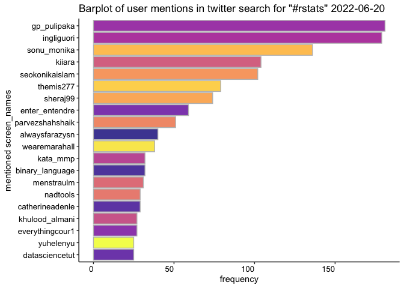
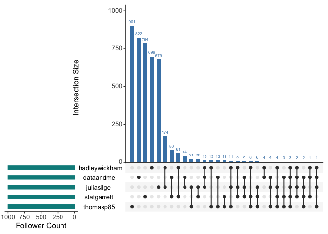
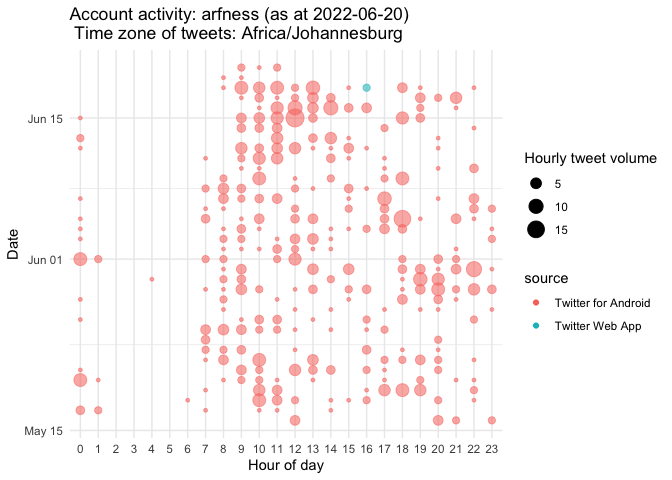

rtweetXtras
-----------

A collection of helper functions for twitter analysis using the {rtweet}
package. NB: these functions have MANY dependencies… no warranty is
offered, but please feel free to log issues.

`hashtagcloud(rtweet_timeline_df, num_words = 200)` Deivers a wordcloud
of hashtag terms in an rtweet tibble.

    df <- rtweet::get_timeline("jack", n=1000)
    rtweetXtras::hashtagcloud(df, n=200)

`profilecloud(rtweet_timeline_df, num_words = 200)` Delivers a wordcloud
of terms in unique twitter user profiles in an rtweet tibble

    df1 <- rtweet::search_tweets("rstats",lang = "en", n= 2000)
    rtweetXtras::profilecloud(df1, 100)

`bar_plot_mentions(rtweet_df, no_of_bars = 20, title = NULL)` Delivers a
bar plot of the count of user mentions in an rtweet tibble. Defaults to
top twenty mentioned accounts.

    df1 <- rtweet::search_tweets("#rstats", lang = "en", n = 2000)
    rtweetXtras::bar_plot_mentions(df1, 20, title = paste("Barplot of user mentions in twitter search for \"#rstats\"", Sys.Date()))

`common_follower_analysis (user_list, follower_depth = 200, no_of_sets = 7)`
This function creates an UpSetR graph of common followers Code cribbed
from Bob Rudis’ 21 Recipes for Mining Twitter with Rtweet
<a href="https://rud.is/books/21-recipes/visualizing-intersecting-follower-sets-with-upsetr.html" class="uri">https://rud.is/books/21-recipes/visualizing-intersecting-follower-sets-with-upsetr.html</a>

     rstats_list <- c("hadleywickham", "dataandme", "juliasilge", "statgarrett","thomasp85")
     token <- NULL #function requires that the twitter token is specifically assigned as "token", using NULL will use the rtweet default.
    rtweetXtras::common_follower_analysis(rstats_list, follower_depth = 1000, no_of_sets = 5)

`common_follower_matrix (user_list, follower_depth = 200)` This function
creates a matrix of followers of a list of twitter users, sums the
number of common followers, and then ranks them in descending order.

      rstats_list <- c("hadleywickham", "dataandme", "juliasilge", "statgarrett","thomasp85")
     token <- NULL #function requires that the twitter token is specifically assigned as "token", using NULL will use the rtweet default.
     fm <- rtweetXtras::common_follower_matrix(rstats_list, follower_depth = 200)
     dplyr::glimpse(fm)

    ## Observations: 852
    ## Variables: 9
    ## $ screen_name       <chr> "Joseph7ee", "bimbosanusi", "JonathanJayes", "Barzi…
    ## $ user_id           <chr> "1242579922075303936", "233985333", "349864194", "1…
    ## $ hadleywickham     <dbl> 1, 1, 1, 1, 0, 1, 1, 1, 1, 1, 1, 1, 1, 1, 0, 0, 0, …
    ## $ dataandme         <dbl> 1, 1, 1, 1, 1, 0, 1, 1, 1, 1, 1, 0, 0, 1, 1, 1, 1, …
    ## $ juliasilge        <dbl> 1, 1, 0, 1, 1, 1, 0, 1, 1, 1, 0, 1, 1, 1, 0, 1, 0, …
    ## $ statgarrett       <dbl> 1, 1, 1, 0, 1, 0, 0, 0, 0, 0, 0, 0, 0, 0, 1, 0, 1, …
    ## $ thomasp85         <dbl> 1, 1, 1, 1, 1, 1, 1, 0, 0, 0, 1, 1, 1, 0, 1, 1, 1, …
    ## $ sum_intersections <dbl> 5, 5, 4, 4, 4, 3, 3, 3, 3, 3, 3, 3, 3, 3, 3, 3, 3, …
    ## $ ranking           <int> 1, 1, 2, 2, 2, 3, 3, 3, 3, 3, 3, 3, 3, 3, 3, 3, 3, …

`account_activity(account_name, depth = 3200, time_zone = "Africa/Johannesburg", no_of_weeks = 4,  token = NULL)`
This function creates a bubble plot of account activity by hour of a
single twitter screen\_name (inspired by python script by twitter user
“@Conspirator0”)

     rtweetXtras::account_activity("arfness", depth = 1000, time_zone = "Africa/Johannesburg", no_of_weeks = 5, token = NULL)

The package includes some additional tools and wrappers for rtweet
functions:

`get_followers_fast` and `get_friends_fast` wrap rtweet functions to
deliver a tibble of followers/friends that includes user details. In
addition it is possible to pass a list of tokens to the function to
manage ratelimiting when querying accounts with large
following/friendship.

`number_followers` allocates a number to the following order in a tibble
of followers, and adds a column that indicates the earliest possible
following date.

`rtweet_net` and `save_csv_edgelist` are functions to create an igraph
network and to save that as an edgelist for use in external
visualisation software. This is not being maintained - replaced by
`create_gexf`

`create_gexf` creates a gexf file for export to Gephi for visualisation.
